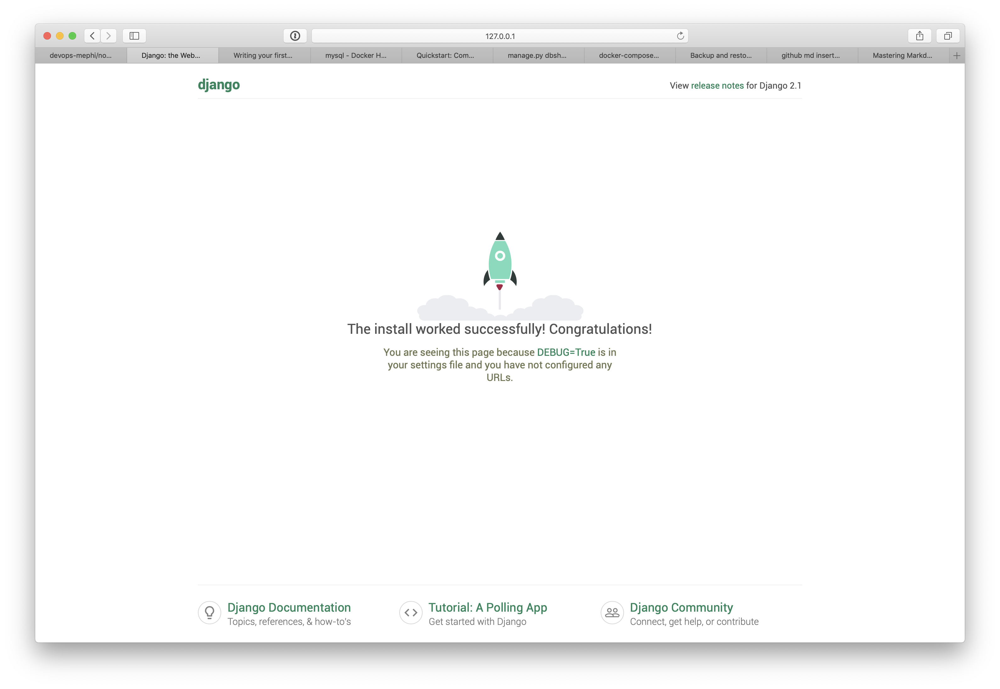
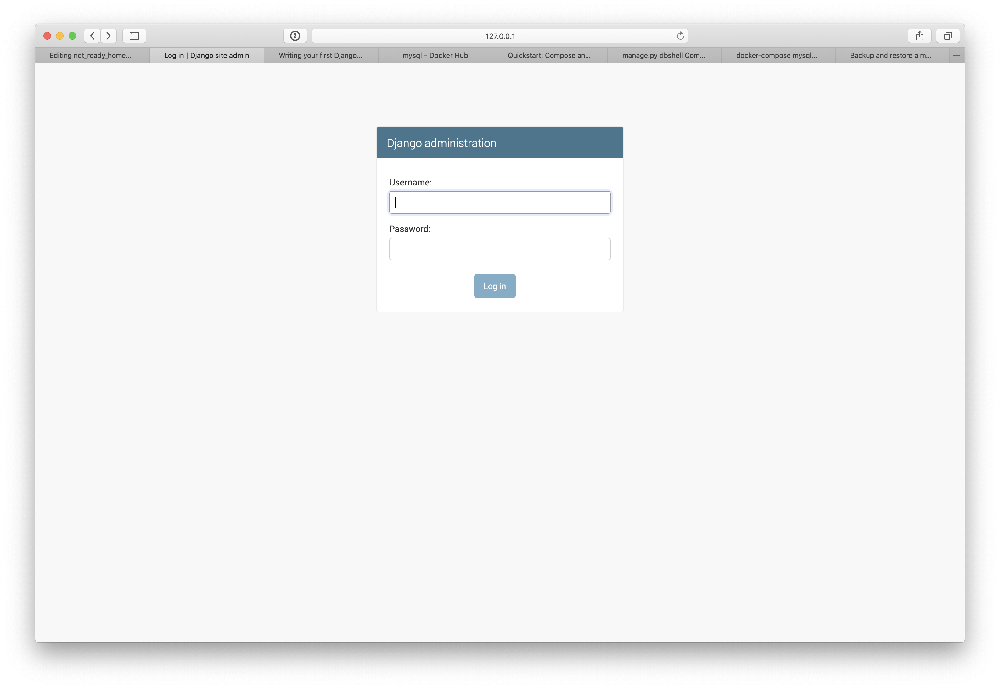
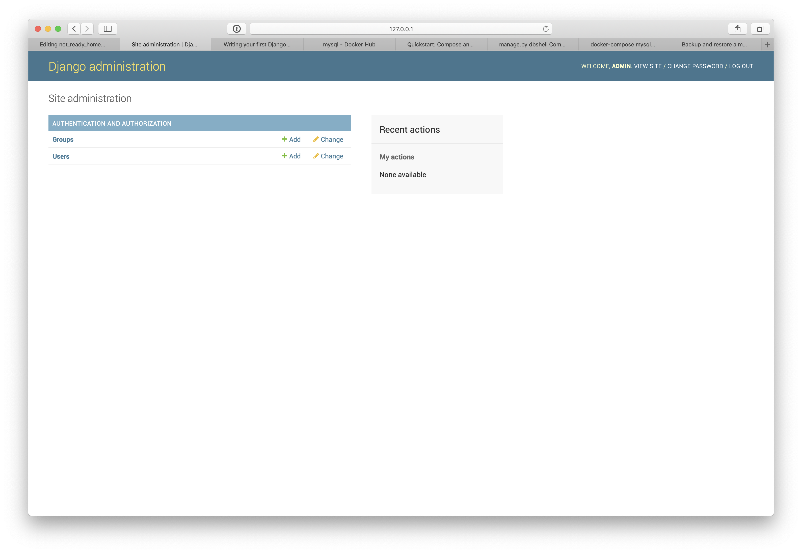

# Docker-compose

Перед запуском виртуалки пробросим еще несколько портов используя Vagrantfile
```
  config.vm.network "forwarded_port", guest: 8000, host: 8000
  config.vm.network "forwarded_port", guest: 8001, host: 8001
  config.vm.network "forwarded_port", guest: 8002, host: 8002
  config.vm.network "forwarded_port", guest: 8003, host: 8003
  config.vm.network "forwarded_port", guest: 8004, host: 8004
  config.vm.network "forwarded_port", guest: 8005, host: 8005
```

После изменений в Vagrantfile нужно остановить и запустить виртуалку заново
```
vagrant halt
vagrant up
```

## Установка docker-compose

в виртуалке с centos7

1. Рекомендуемый способ установки: скачивание binary-файла с docker-compose

```
sudo curl -L https://github.com/docker/compose/releases/download/1.24.0-rc1/docker-compose-`uname -s`-`uname -m` -o /usr/local/bin/docker-compose
```

2. Установка прав на выполнение

```
sudo chmod +x /usr/local/bin/docker-compose
```

3. Создание символической ссылки 

```
sudo ln -s /usr/local/bin/docker-compose /usr/bin/docker-compose
```

4. Проверяем успешность установки

```
[vagrant@localhost ~]$ docker-compose version
docker-compose version 1.24.0-rc1, build 0f3d4dda
docker-py version: 3.7.0
CPython version: 3.6.8
OpenSSL version: OpenSSL 1.1.0j  20 Nov 2018
```

## Работа с docker-compose.

Попробуем реализовать веб-сервер, который делали на прошлом занятии.
1. Если осталась с прошлого занятия папка http_server, зайдем в неё, если нет, создайте новую
```
mkdir http_server
```

2. Создаем Dockerfile

```
vi Dockerfile
```

Содержимое:
```
# version 0.0.2

FROM centos:7

MAINTAINER Alexey Kurt <a.kurt@corp.mail.ru>

RUN yum install -y epel-release

RUN yum install -y nginx

ADD index.html /usr/share/nginx/html/index.html

EXPOSE 80

CMD ["/usr/sbin/nginx", "-g daemon off;"]
```

3. Теперь, в прошлом занятии мы поднимали его после сборки следующим образом:
```
sudo docker run -d -p 8000:80 http_server
```

Тут нужно помнить, что есть порт 80, который нужно куда-то прокинуть, помнить название сервиса и ключи, с которыми это всё нужно запустить. Когда сервисов становится больше, чем один, становится довольно сложно запомнить и воспроизвести много docker-команд по запуску этих контейнеров и связыванию их ports/volumes между собой. Для решения этой проблемы был придуман docker-compose.

Он позволяет описать структуру всех используемых в проекте контейнеров в одном yaml файле. Попробуем описать http_server.

4. Создадим файл docker-compose.yml

```
vi docker-compose.yml
```

В нем пропишем следующее:

```
version: '3'

services:
  http_server:
    build: .
    ports:
      - "8000:80"
```


5. Запуск по одной кнопке

```
[vagrant@localhost http_server]$ sudo docker-compose up
Creating network "http_server_default" with the default driver
Building http_server
Step 1/7 : FROM centos:7
 ---> 1e1148e4cc2c
Step 2/7 : MAINTAINER Alexey Kurt <a.kurt@corp.mail.ru>
 ---> Using cache
 ---> d43f40c7fac6
Step 3/7 : RUN yum install -y epel-release
 ---> Using cache
 ---> ea42a1359c1e
Step 4/7 : RUN yum install -y nginx
 ---> Using cache
 ---> fd48f748887e
Step 5/7 : ADD index.html /usr/share/nginx/html/index.html
 ---> caa8ec3f2cfc
Step 6/7 : EXPOSE 80
 ---> Running in daac3dd5e549
Removing intermediate container daac3dd5e549
 ---> b82b7361f29f
Step 7/7 : CMD ["/usr/sbin/nginx", "-g daemon off;"]
 ---> Running in c049fa4fdb7d
Removing intermediate container c049fa4fdb7d
 ---> 8eff8c05c67b
Successfully built 8eff8c05c67b
Successfully tagged http_server_http_server:latest
WARNING: Image for service http_server was built because it did not already exist. To rebuild this image you must use `docker-compose build` or `docker-compose up --build`.
Creating http_server_http_server_1 ... done
Attaching to http_server_http_server_1
```

Как мы видим, docker-compose успешно понял, что образ нужно собрать, собрал его, запустил и правильно пробросил нужные порты

6. Проверяем, что всё в порядке

из соседней консоли
```
[vagrant@localhost ~]$ curl 127.0.0.1:8000
<html>
<h1>My first http server</h1>
</html>
```

7. Остановить можно, нажав ctr-c в консоли с docker-compose

```
^CGracefully stopping... (press Ctrl+C again to force)
Stopping http_server_http_server_1 ... done
[vagrant@localhost http_server]$
```

8. Запустим еще раз

```
[vagrant@localhost http_server]$ sudo docker-compose up
Starting http_server_http_server_1 ... done
Attaching to http_server_http_server_1
```
На этот раз docker-compose не стал собирать заново образ, а просто его запустил

9. Из соседней консоли можно посмотреть список запущенных "служб"

```
[vagrant@localhost http_server]$ sudo docker-compose ps
          Name                         Command               State          Ports
-----------------------------------------------------------------------------------------
http_server_http_server_1   /usr/sbin/nginx -g daemon off;   Up      0.0.0.0:8000->80/tcp
```

10. Можно запустить любую команду внутри запущенного контейнера 

```
[vagrant@localhost http_server]$ sudo docker-compose run http_server bash
[root@e058b7b64359 /]# date
Sun Mar 10 10:55:16 UTC 2019
```

11. Можно остановить всё вот так

```
[vagrant@localhost http_server]$ sudo docker-compose stop
Stopping http_server_http_server_1 ... done
```

12. А теперь попробуем изменить файл index.html

```
[vagrant@localhost http_server]$ vi index.html
```

```
<html>
<h1>My first http server</h1>
<h2>It changed!/h2>
</html>
```

13. Запустим 

```
[vagrant@localhost http_server]$ sudo docker-compose up
Starting http_server_http_server_1 ... done
Attaching to http_server_http_server_1
```

Мы видим, что образ не был пересобран. Docker-compose просто проверяет, есть ли образ с таким именем или нет:
```
[vagrant@localhost http_server]$ sudo docker images
REPOSITORY                TAG                 IMAGE ID            CREATED             SIZE
http_server_http_server   latest              8eff8c05c67b        14 minutes ago      451MB
```

14. Чтобы таки-пересобрать образ, нужно делать так:

```
[vagrant@localhost http_server]$ sudo docker-compose build
Building http_server
Step 1/7 : FROM centos:7
 ---> 1e1148e4cc2c
Step 2/7 : MAINTAINER Alexey Kurt <a.kurt@corp.mail.ru>
 ---> Using cache
 ---> d43f40c7fac6
Step 3/7 : RUN yum install -y epel-release
 ---> Using cache
 ---> ea42a1359c1e
Step 4/7 : RUN yum install -y nginx
 ---> Using cache
 ---> fd48f748887e
Step 5/7 : ADD index.html /usr/share/nginx/html/index.html
 ---> 4e92d4192e24
Step 6/7 : EXPOSE 80
 ---> Running in bf50e5447304
Removing intermediate container bf50e5447304
 ---> 40cfbfd853e8
Step 7/7 : CMD ["/usr/sbin/nginx", "-g daemon off;"]
 ---> Running in 9241c24a1ad0
Removing intermediate container 9241c24a1ad0
 ---> 70de52ebbc5c
Successfully built 70de52ebbc5c
Successfully tagged http_server_http_server:latest
```

15. Удалить полностью все контейнеры/образы/сети вот так

```
[vagrant@localhost http_server]$ sudo docker-compose down
Removing http_server_http_server_1 ... done
Removing network http_server_default
```


## Создание среды для разработки проекта python+django+mysql

Допустим, мы хотим начать разрабатывать приложение, которое написано на python, использует django и mysql. Мы хотим, чтобы среда для разработки этого приложения для другого разработчика поднималась по одной кнопке. Docker-compose позволяет нам это сделать. По сути это более удобный способ описывать и управлять несколькими docker-контейнерами. Всё описание хранится в одном файле, который имеет имя docker-compose.yml. После того, как в нем всё описано, одной командой 'docker-compose up' соберутся/скачаются нужные docker-образы и запустятся контейнеры, правильно связавшись между собой.

Наш будущий проект будет использовать python3. Будем использовать официальной image с установленным внутрь него python'ом: https://hub.docker.com/r/library/python

1. Начнем с создания новой папки

```
[vagrant@localhost ~]$ mkdir banners
[vagrant@localhost ~]$ cd banners/
[vagrant@localhost banners]$
```

2. В ней Dockerfile

```
[vagrant@localhost banners]$ vi Dockerfile
```
следующего содержания:
```
FROM python:3.7

WORKDIR /code/

COPY requirements.txt ./

RUN pip install --no-cache-dir -r requirements.txt

COPY . .
```

3. В файле requiremets.txt ожидается понятный для pip список зависимостей, которые требуются для данного проекта. Мы будем использовать Django и базу данных mysql, значит нам нужен пакет mysqladmin.
Это мы узнали из официальной документации Django: https://docs.djangoproject.com/en/2.1/ref/databases/#mysql-db-api-drivers

```
[vagrant@localhost banners]$ vi requirements.txt
```
содержания:
```
Django==2.1.7
mysqlclient==1.4.2
```

4. Теперь docker-compose файл. Будем постепенно добавлять в него нужные опции. Начнем с простого:

```
[vagrant@localhost banners]$ vi docker-compose.yml
```

а в нем
```
version: '3'

services:
  web:
    build: .
    ports:
      - "8000:8000"
    volumes:
      - .:/code
```

Строчка с volumes говорит нам пробросить текущую директорию внутри контейнера по пути /code. Это нужно затем, чтобы программисту не приходилось пересобирать каждый раз образ при правке кода (что было бы для него мучением)

5. Попробуем собрать образ:

```
[vagrant@localhost banners]$ sudo docker-compose build
Building web
Step 1/5 : FROM python:3.7
3.7: Pulling from library/python
22dbe790f715: Pull complete
0250231711a0: Pull complete
6fba9447437b: Pull complete
c2b4d327b352: Pull complete
270e1baa5299: Pull complete
8dc8edf0ab44: Pull complete
86ded05de41b: Pull complete
1eac5266a8fa: Pull complete
61b3f1392c29: Pull complete
Digest: sha256:166ad1e6ca19a4b84a8907d41c985549d89e80ceed2f7eafd90dca3e328de23e
Status: Downloaded newer image for python:3.7
 ---> 32260605cf7a
Step 2/5 : WORKDIR /code/
 ---> Running in 21181b37e853
Removing intermediate container 21181b37e853
 ---> a1097e3a0310
Step 3/5 : COPY requirements.txt ./
 ---> 9c4fc5c92aff
Step 4/5 : RUN pip install --no-cache-dir -r requirements.txt
 ---> Running in f7cb04c9cf2e
Collecting Django==2.1.7 (from -r requirements.txt (line 1))
  Downloading https://files.pythonhosted.org/packages/c7/87/fbd666c4f87591ae25b7bb374298e8629816e87193c4099d3608ef11fab9/Django-2.1.7-py3-none-any.whl (7.3MB)
Collecting mysqlclient==1.4.2 (from -r requirements.txt (line 2))
  Downloading https://files.pythonhosted.org/packages/73/79/67ddf24ac31b05d741f0ac87fa612c7a11bab1b39b8270ed7344d149f8af/mysqlclient-1.4.2.tar.gz (85kB)
Collecting pytz (from Django==2.1.7->-r requirements.txt (line 1))
  Downloading https://files.pythonhosted.org/packages/61/28/1d3920e4d1d50b19bc5d24398a7cd85cc7b9a75a490570d5a30c57622d34/pytz-2018.9-py2.py3-none-any.whl (510kB)
Installing collected packages: pytz, Django, mysqlclient
  Running setup.py install for mysqlclient: started
    Running setup.py install for mysqlclient: finished with status 'done'
Successfully installed Django-2.1.7 mysqlclient-1.4.2 pytz-2018.9
Removing intermediate container f7cb04c9cf2e
 ---> ee97cea9ae6d
Step 5/5 : COPY . .
 ---> 72af71c4cab5
Successfully built 72af71c4cab5
Successfully tagged banners_web:latest
```

Всё сработало.

6. Как мы знаем из документации django, создать начальные файлы для проекта можно следующей командой:

```
django-admin startproject mysite
```

Сделать это в нашем случае (внутри контейнера) можно следующим образом:

```
[vagrant@localhost banners]$ sudo docker-compose run web django-admin startproject banners .
[vagrant@localhost banners]$
```
мы добавили точку в конце, чтобы django не создала еще одну промежуточную папку, а положила manage.py сразу в текущую директорию

7. Посмотрим, что получилось:

```
[vagrant@localhost banners]$ ls -lh
total 16K
-rw-rw-r--. 1 vagrant vagrant 121 Mar 10 12:32 Dockerfile
drwxr-xr-x. 2 root    root     74 Mar 10 12:44 banners
-rw-rw-r--. 1 vagrant vagrant 104 Mar 10 12:41 docker-compose.yml
-rwxr-xr-x. 1 root    root    539 Mar 10 12:44 manage.py
-rw-rw-r--. 1 vagrant vagrant  33 Mar 10 12:27 requirements.txt
```

Команда django-admin создала файл manage.py и папку banners. Как мы видим, файлы принадлежат пользователю root. Это потому что внутри контейнера все выполнялось из-под root.

8. Исправим права

```
[vagrant@localhost banners]$ sudo chown -R vagrant:vagrant .
[vagrant@localhost banners]$ ls -lh
total 16K
-rw-rw-r--. 1 vagrant vagrant 121 Mar 10 12:32 Dockerfile
drwxr-xr-x. 2 vagrant vagrant  74 Mar 10 12:44 banners
-rw-rw-r--. 1 vagrant vagrant 104 Mar 10 12:41 docker-compose.yml
-rwxr-xr-x. 1 vagrant vagrant 539 Mar 10 12:44 manage.py
-rw-rw-r--. 1 vagrant vagrant  33 Mar 10 12:27 requirements.txt
```

9. Запустить проект теперь можно так:

```
[vagrant@localhost banners]$ sudo docker-compose run web python manage.py runserver 0.0.0.0:8000
Performing system checks...

System check identified no issues (0 silenced).

You have 15 unapplied migration(s). Your project may not work properly until you apply the migrations for app(s): admin, auth, contenttypes, sessions.
Run 'python manage.py migrate' to apply them.

March 10, 2019 - 12:47:55
Django version 2.1.7, using settings 'banners.settings'
Starting development server at http://0.0.0.0:8000/
Quit the server with CONTROL-C.
^C
```

10. Убедившись, что проект запускается, пропишем строку запуска сразу в Dockerfile

```
[vagrant@localhost banners]$ echo 'CMD python manage.py runserver 0.0.0.0:8000' >> Dockerfile
```

11. Пересоберем образ

```
[vagrant@localhost banners]$ sudo docker-compose build
Building web
Step 1/6 : FROM python:3.7
 ---> 32260605cf7a
Step 2/6 : WORKDIR /code/
 ---> Using cache
 ---> a1097e3a0310
Step 3/6 : COPY requirements.txt ./
 ---> Using cache
 ---> 9c4fc5c92aff
Step 4/6 : RUN pip install --no-cache-dir -r requirements.txt
 ---> Using cache
 ---> ee97cea9ae6d
Step 5/6 : COPY . .
 ---> 44b6d9893591
Step 6/6 : CMD python manage.py runserver 0.0.0.0:8000
 ---> Running in cdc6e61762b9
Removing intermediate container cdc6e61762b9
 ---> e4c590eed70c
Successfully built e4c590eed70c
Successfully tagged banners_web:latest
```

12. Запустим

```
[vagrant@localhost banners]$ sudo docker-compose up
Creating banners_web_1 ... done
Attaching to banners_web_1
```

13. Откроем еще одну консоль и попробуем подключиться

```
[vagrant@localhost http_server]$ curl 127.0.0.1:8000

<!doctype html>
<html>
    <head>
        <meta charset="utf-8">
        <title>Django: the Web framework for perfectionists with deadlines.</title>

....

```
Поскольку порт 8000 проброшен из виртуалки, то можно попробовать открыть в браузере

```
http://127.0.0.1:8000/
```



Консоль с docker-compose при этом выводит лог, что полезно при разработке:

```
[vagrant@localhost banners]$ sudo docker-compose up
Creating network "banners_default" with the default driver
Creating banners_web_1 ... done
Attaching to banners_web_1
web_1  | [10/Mar/2019 13:12:25] "GET / HTTP/1.1" 200 16348
web_1  | [10/Mar/2019 13:12:35] "GET / HTTP/1.1" 200 16348
web_1  | [10/Mar/2019 13:12:36] "GET /static/admin/css/fonts.css HTTP/1.1" 200 423
web_1  | [10/Mar/2019 13:12:37] "GET /static/admin/fonts/Roboto-Regular-webfont.woff HTTP/1.1" 200 80304
web_1  | [10/Mar/2019 13:12:37] "GET /static/admin/fonts/Roboto-Bold-webfont.woff HTTP/1.1" 200 82564
web_1  | [10/Mar/2019 13:12:37] "GET /static/admin/fonts/Roboto-Light-webfont.woff HTTP/1.1" 200 81348
web_1  | Not Found: /favicon.ico
web_1  | [10/Mar/2019 13:12:43] "GET /favicon.ico HTTP/1.1" 404 1973
```

## Добавляем mysql

1. Воспользуемся официальным docker-образом mysql. https://hub.docker.com/_/mysql

Прочитав его, допишем в наш docker-compose.yml следующее:

```
version: '3'

services:
  web:
    build: .
    ports:
      - "8000:8000"
    volumes:
      - .:/code
    depends_on:
      - db
  db:
    image: mysql:5.7
    command: --default-authentication-plugin=mysql_native_password
    restart: always
    ports:
      - "3306:3306"
    environment:
      MYSQL_RANDOM_ROOT_PASSWORD: "yes"
      MYSQL_USER: developer
      MYSQL_PASSWORD: 1234
      MYSQL_DATABASE: mephi
```

Пароль не боимся светить, потому что это временный контейнер на нашей локальной машине.

2. Попробуем запустить

```
[vagrant@localhost banners]$ sudo docker-compose up
Creating network "banners_default" with the default driver
Creating banners_web_1 ... done
Creating banners_db_1  ... done
Attaching to banners_db_1, banners_web_1
db_1   | Initializing database

дальше много много вывода — инициализации БД

db_1   | 2019-03-10T14:41:50.488964Z 0 [Note] Event Scheduler: Loaded 0 events
db_1   | 2019-03-10T14:41:50.489938Z 0 [Note] mysqld: ready for connections.
db_1   | Version: '5.7.25'  socket: '/var/run/mysqld/mysqld.sock'  port: 3306  MySQL Community Server (GPL)
```

3. Откроем дополнительную консоль и поменяем в проекте настройки базы данных

```
[vagrant@localhost banners]$ vi banners/settings.py
```

Найдем блок DATABASES и приведем его к следующему виду:
```
# Database
# https://docs.djangoproject.com/en/2.1/ref/settings/#databases

DATABASES = {
    'default': {
        'ENGINE': 'django.db.backends.mysql',
        'NAME': 'mephi',
        'USER': 'developer',
        'PASSWORD': '1234',
        'HOST': 'db',
        'PORT': '3306',
    }
}
```

4. В консоли с запущенным docker-compose видим следующее:

```
web_1  | Performing system checks...
web_1  | 
web_1  | System check identified no issues (0 silenced).
web_1  | 
web_1  | You have 15 unapplied migration(s). Your project may not work properly until you apply the migrations for app(s): admin, auth, contenttypes, sessions.
web_1  | Run 'python manage.py migrate' to apply them.
web_1  | March 10, 2019 - 14:41:38
web_1  | Django version 2.1.7, using settings 'banners.settings'
web_1  | Starting development server at http://0.0.0.0:8000/
web_1  | Quit the server with CONTROL-C.
```

Что произошло? Когда в django-проекте меняется код, сервер, запущенный по runserver автоматически перезагружает код. Это полезно, потому что не нужно останавливать/запускать окружение.

Но обратим внимание на следующие строчки:
```
web_1  | You have 15 unapplied migration(s). Your project may not work properly until you apply the migrations for app(s): admin, auth, contenttypes, sessions.
web_1  | Run 'python manage.py migrate' to apply them.
```

Что это? В конфиге django подключены "приложения" для авторизации, админки и сессий. Для их работы в базе данных нужны определенные таблички, которые создадутся, если набрать manage.py migrate

5. Давайте это и сделаем (в другой консоли)

```
[vagrant@localhost banners]$ sudo docker-compose run web python manage.py migrate
Operations to perform:
  Apply all migrations: admin, auth, contenttypes, sessions
Running migrations:
  Applying contenttypes.0001_initial... OK
  Applying auth.0001_initial... OK
  Applying admin.0001_initial... OK
  Applying admin.0002_logentry_remove_auto_add... OK
  Applying admin.0003_logentry_add_action_flag_choices... OK
  Applying contenttypes.0002_remove_content_type_name... OK
  Applying auth.0002_alter_permission_name_max_length... OK
  Applying auth.0003_alter_user_email_max_length... OK
  Applying auth.0004_alter_user_username_opts... OK
  Applying auth.0005_alter_user_last_login_null... OK
  Applying auth.0006_require_contenttypes_0002... OK
  Applying auth.0007_alter_validators_add_error_messages... OK
  Applying auth.0008_alter_user_username_max_length... OK
  Applying auth.0009_alter_user_last_name_max_length... OK
  Applying sessions.0001_initial... OK
```

Что произошло: 
django-проект успешно подсоединился к БД, запущенной в соседнем контейнере, и создал в ней некие таблички, применив поверх них альтеры.

6. В контейнере с mysql также есть клиент, которым можно подсединиться к БД (необязательно устанавливать его на локальную машину). 

Давайте подсоединимся
```
[vagrant@localhost banners]$ sudo docker-compose run db mysql -udeveloper -p1234 -hdb
mysql: [Warning] Using a password on the command line interface can be insecure.
Welcome to the MySQL monitor.  Commands end with ; or \g.
Your MySQL connection id is 5
Server version: 5.7.25 MySQL Community Server (GPL)

Copyright (c) 2000, 2019, Oracle and/or its affiliates. All rights reserved.

Oracle is a registered trademark of Oracle Corporation and/or its
affiliates. Other names may be trademarks of their respective
owners.

Type 'help;' or '\h' for help. Type '\c' to clear the current input statement.

mysql>
```

Вот они созданные таблицы в бд mephi:

```
mysql> show databases;
+--------------------+
| Database           |
+--------------------+
| information_schema |
| mephi              |
+--------------------+
2 rows in set (0.09 sec)

mysql> use mephi;
Reading table information for completion of table and column names
You can turn off this feature to get a quicker startup with -A

Database changed
mysql> show tables;
+----------------------------+
| Tables_in_mephi            |
+----------------------------+
| auth_group                 |
| auth_group_permissions     |
| auth_permission            |
| auth_user                  |
| auth_user_groups           |
| auth_user_user_permissions |
| django_admin_log           |
| django_content_type        |
| django_migrations          |
| django_session             |
+----------------------------+
10 rows in set (0.00 sec)

mysql> 

```

7. Можем попробовать открыть страницу логина в админку django:

http://127.0.0.1:8000/admin/login/?next=/admin/



Ой, оно просит пароль, но какой пароль?
Нужно установить пароль администратора в django. Смотрим документацию https://docs.djangoproject.com/en/2.1/intro/tutorial02/#creating-an-admin-user

Ага, нужно выполнить manage.py createsuperuser

Сделаем!
```
[vagrant@localhost banners]$ sudo docker-compose run web python manage.py createsuperuser
Username (leave blank to use 'root'): admin
Email address: admin@admin.ru
Password: 
Password (again): 
Superuser created successfully.
```

8. Попробуем залогиниться:

http://127.0.0.1:8000/admin/login/?next=/admin/

вводим логин-пароль, успех!



9. Теперь нужно хорошо понимать, что все изменения с БД мы вносили в базу внутри контейнера, что значит, что, убив этот контейнер, мы потеряем все изменения. Да и вообще мы хотели сделать среду, которая по одной кнопке разворачивается и полностью работает. Значит нужно сделать так, чтобы изменения, сделанные нами выше, применялись при создании контейнера. Почитав документацию по docker-образу mysql видим, что есть специальный путь в ФС контейнера, куда можно подложить sql файлы. При первом старте оно подтянет эти файлы и применит изменения внутри БД (/docker-entrypoint-initdb.d)

Нужно снять дамп с работающей БД в контейнере. К счастью, внутри mysql-образа есть команда mysqldump/
Можно сделать это так:

```
[vagrant@localhost banners]$ sudo docker-compose run db mysqldump -udeveloper -p1234 -hdb mephi
```

Выведется много sql'а, который будет генерировать базу mephi в её текущем виде.
Засунем это в файл init.sql в папку db

```
[vagrant@localhost banners]$ pwd
/home/vagrant/banners
[vagrant@localhost banners]$ mkdir db
[vagrant@localhost banners]$ sudo docker-compose run db mysqldump -udeveloper -p1234 -hdb mephi > db/init.sql
```

Убедимся, что всё получилось

```
[vagrant@localhost banners]$ head db/init.sql 
mysqldump: [Warning] Using a password on the command line interface can be insecure.
-- MySQL dump 10.13  Distrib 5.7.25, for Linux (x86_64)
--
-- Host: db    Database: mephi
-- ------------------------------------------------------
-- Server version	5.7.25

/*!40101 SET @OLD_CHARACTER_SET_CLIENT=@@CHARACTER_SET_CLIENT */;
/*!40101 SET @OLD_CHARACTER_SET_RESULTS=@@CHARACTER_SET_RESULTS */;
/*!40101 SET @OLD_COLLATION_CONNECTION=@@COLLATION_CONNECTION */;
```

10. Подсунем этот файл в /docker-entrypoint-initdb.d в контейнер mysql через docker-compose.yml

допишем вот это в docker-compose.yml в сервис db
```
    volumes:
      - ./db:/docker-entrypoint-initdb.d
```

11. Теперь нужно проверить, что всё получилось: убиваем полностью контейнеры и поднимаем заново.

```
[vagrant@localhost banners]$ sudo docker-compose down
Stopping banners_web_1 ... done
Removing banners_db_run_1d3dda187c19  ... done
Removing banners_db_run_7fb184308289  ... done
Removing banners_db_run_df980624b8d8  ... done
Removing banners_db_run_ebc435f22edf  ... done
Removing banners_web_run_868c1fb4f5ae ... done
Removing banners_db_run_759cc22a3a65  ... done
Removing banners_db_run_644f1a7c98b9  ... done
Removing banners_db_run_d2a975937650  ... done
Removing banners_db_run_c7743e4c4ed3  ... done
Removing banners_web_run_f3838db38636 ... done
Removing banners_web_run_f553ecc866bf ... done
Removing banners_web_run_e33a20c4ac9b ... done
Removing banners_web_run_5266921cb018 ... done
Removing banners_db_1                 ... done
Removing banners_web_1                ... done
Removing network banners_default
```

поднимаем:
```
[vagrant@localhost banners]$ sudo docker-compose up
Creating network "banners_default" with the default driver
Creating banners_db_1  ... done
Creating banners_web_1 ... done
Attaching to banners_web_1, banners_db_1
db_1   | Initializing database

....

db_1   | Version: '5.7.25'  socket: '/var/run/mysqld/mysqld.sock'  port: 3306  MySQL Community Server (GPL)
```

пробуем залогиниться по тому же самому паролю: http://127.0.0.1:8000/admin/login/?next=/admin/

успех!

## Собираем все вместе

1. Давайте создадим в gitlab новый проект, назовем его banners

2. Закоммитим и запушим содержимое папки banners в этот проект

3. Советую завести аккаунт на github и запушить проект еще и туда (на случай, если с виртуалкой что-то случится). Мы дальше будем продолжать работу над этим проектом.

4. Создадим README.md в корне проекта следующего содержания

```
# Banners

## Чтобы развернуть проект, сделайте в корне проекта:

sudo docker-compose up

проект будет доступен по адресу http://127.0.0.1:8000/
```
